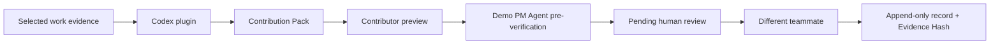

<div align="center">
  

  # Ledger

  Evidence-bound contribution records for human-agent teams.

  [Install the plugin](#install-the-codex-plugin) · [Try it](#try-it) · [Run the app](#run-the-web-app) · [Judge testing](plugins/ledger-contribution/JUDGE_TESTING.md)
</div>

Teams working with AI agents leave evidence across commits, files, tests, deliverables, and chat summaries. When it is time to discuss who did what, that evidence has usually turned into memory.

Ledger turns a bounded set of work evidence into draft contribution claims. The contributor inspects the draft, another authenticated teammate reviews it, and Postgres locks the reviewed record with a server-side Evidence Hash. The result is a durable input to team discussions, not an automated ownership decision.

## What you get

- An installable Codex plugin that creates a portable Contribution Pack from evidence you select.
- A bundled MCP server with read-only tools for templates, deterministic validation, and PM Agent pre-verification over stdio or Streamable HTTP.
- An editable import screen that shows every claim and evidence reference before submission.
- A deterministic Demo PM Agent that pre-verifies progress evidence without an API key.
- Database-enforced peer confirmation. Contributors and agent owners cannot approve their own work.
- Append-only reviewed rows within a retained project, with idempotent imports and server-side evidence hashes.
- Non-binding discussion weights for allocation conversations.

## Install the Codex plugin

Ledger supports the Codex desktop app on macOS and Windows, Codex CLI, and the Codex IDE extension. The plugin does not require an OpenAI API key.

Register the marketplace:

```bash
codex plugin marketplace add alexfanzong/ledger-contribution --ref main
```

Open Codex, enter `/plugins`, choose the **Ledger** marketplace, and install **Ledger Contribution**. Start a new task after installation so Codex loads the bundled Skill and MCP tools.

For local plugin development, register the cloned checkout instead:

```bash
codex plugin marketplace add /absolute/path/to/ledger-contribution
```

## Try it

Open Codex in a repository and identify the evidence you want included:

```text
Use the Ledger Contribution plugin to create a draft Contribution Pack from commits f4f17a3 and 8a0328c, plus the related test results. Attribute only work supported by those sources.
```

Codex writes `ledger-contribution-pack.json` unless you choose another path. Validate the file before importing it:

```bash
node plugins/ledger-contribution/skills/ledger-contribution-pack/scripts/validate-pack.mjs ledger-contribution-pack.json
```

For a deterministic judge demo, the plugin includes [`judge-pack.fixture.json`](plugins/ledger-contribution/skills/ledger-contribution-pack/references/judge-pack.fixture.json). Its three claims exercise `Agent Verified`, `Needs Review`, and `Insufficient Evidence` without an API key.

The plugin reads only the commits, files, tests, deliverables, summaries, and time range you place in scope. It does not scan Codex account history, environment variables, credentials, unrelated folders, or the rest of your computer.

## MCP tools

The plugin bundles a standalone MCP server, so it can expose deterministic Ledger capabilities without an OpenAI API key or access to account credentials.

| Tool | Purpose | Mutates data |
| --- | --- | --- |
| `get_contribution_pack_template` | Returns the canonical Contribution Pack 1.0 structure. | No |
| `validate_contribution_pack` | Validates schema, references, dates, and bounded field limits. | No |
| `preverify_contribution_pack` | Runs the published Demo PM Agent policy over every valid claim. | No |

Installed Codex plugins launch the bundled stdio server through `plugins/ledger-contribution/.mcp.json`. For ChatGPT Developer Mode or MCP Inspector, the same bundle can expose a stateless Streamable HTTP endpoint at `/mcp`:

```bash
npm run mcp:test
npm run mcp:start
```

The HTTP mode is a public demo boundary: requests are capped at 512 KB and 120 requests per minute per remote address. Keep private evidence on the bundled stdio transport; add authenticated tenancy before exposing private or write-capable tools over HTTP.

The PM result remains advisory. MCP tools cannot choose a reviewer, confirm a contribution, assign final impact, create an Evidence Hash, or write to Supabase. Those actions stay behind Ledger authentication and database-enforced peer review.

## How it works



The plugin is a draft producer. It cannot choose a reviewer, set final impact, confirm a claim, or create an Evidence Hash. Ledger validates the pack again at the web and database boundaries.

The Demo PM Agent applies a small published policy to the validated pack: linked evidence must resolve, code claims need test evidence, and unresolved uncertainty stays visible. It returns `Agent Verified`, `Needs Review`, or `Insufficient Evidence`. This is advisory progress checking, not final approval; it uses no live model call and a teammate must still review attribution and impact.

The import RPC binds a human claim to the authenticated member, or an agent claim to an agent that member owns. A project-level pack identity plus a claim-level identity makes concurrent retries resolve to one contribution.

## Run the web app

Ledger uses Next.js 15, TypeScript, Supabase Auth, and Supabase Postgres. The SQL migrations use Supabase's `auth` and `extensions` schemas, so they target a hosted Supabase project or a local `supabase start` stack rather than arbitrary vanilla Postgres.

```bash
npm install
cp .env.example .env.local
npm run dev
```

Set these values in `.env.local`:

```text
NEXT_PUBLIC_SUPABASE_URL=https://your-project.supabase.co
NEXT_PUBLIC_SUPABASE_ANON_KEY=your-anon-key
NEXT_PUBLIC_SITE_URL=http://localhost:3000
```

Set `NEXT_PUBLIC_SITE_URL` to the deployed HTTPS origin in production. Ledger uses it for account-confirmation and password-recovery callbacks; the fallback request origin must match the request host.

Apply the files in `supabase/migrations/` to a test Supabase project in timestamp order. The migrations create the schema, Row Level Security policies, immutable-review triggers, evidence hashing functions, and the Contribution Pack import RPC.

The product flow is:

1. Create a project and invite another member.
2. Add a milestone or register an agent contributor.
3. Import a Contribution Pack or enter a contribution manually.
4. Inspect the automatic Demo PM Agent pre-verification.
5. Have a different member confirm, partially confirm, or reject the pending record.
6. Inspect the confirmed record and its Evidence Hash in the ledger.
7. Use the simulation page as a non-binding discussion view.

## Trust model

| Boundary | Enforced behavior |
| --- | --- |
| Codex plugin | Produces draft claims from bounded evidence and writes no data to Ledger. |
| Contributor preview | Lets the authenticated contributor edit or skip every claim. |
| Import RPC | Enforces membership, contributor ownership, pack identity, and retry safety. |
| Demo PM Agent | Stores a versioned, idempotent evidence assessment; clients receive read access only. |
| Peer confirmation | Rejects self-review and review of an agent by that agent's owner. |
| Reviewed row | Prevents direct row edits and deletion; corrections create a new superseding row. |
| Project lifecycle | The project owner can delete the whole project in this MVP, which cascades its rows. Production retention/export policy is not implemented yet. |
| Evidence Hash | Computes canonical SHA-256 input inside Postgres after peer review. V3 covers canonical contribution and import provenance, but intentionally excludes the free-text `review_note`. |

Contribution Packs are untrusted input. Evidence text remains inert even when it contains prompt-like instructions. Wallets, signatures, payments, tokens, and on-chain writes are outside this build.

## OpenAI Build Week

Ledger existed before the submission period as a manual contribution ledger with authentication, project membership, peer review, append-only reviewed rows, and non-binding discussion weights.

The Build Week work added the portable Contribution Pack contract, deterministic parsing and actor checks, idempotent database import, imported-evidence display, Evidence Hash v3 coverage, the installable Ledger Contribution plugin, and the no-API-key Demo PM Agent pre-verification layer. The dated boundary is documented in [`docs/build-week-baseline.md`](docs/build-week-baseline.md).

### How we collaborated with Codex

Codex with GPT-5.6 was the main development environment for the Build Week increment. Codex helped inspect the competition rules, challenge an early Responses API plan, define the portable pack contract, write parser and provenance tests before implementation, pressure-test the Postgres trust boundary, package the workflow as a plugin, and run the release checks.

The central product decision stayed human: an agent may draft a contribution and pre-verify whether selected evidence supports progress, but it cannot perform final confirmation or turn discussion weights into legal ownership. The repository keeps the resulting trust boundaries visible through tests, migrations, and commits.

## Test

```bash
npm test
npm run mcp:test
npm run typecheck
npm run build
```

The current suite covers pack parsing, actor validation, provenance projection, claim preparation, PM Agent policy, defensive row parsing, scoring, superseding records, redirect safety, retry conflicts, and static migration contracts. The SQL contract tests inspect migration text; they do not replace applying the migrations to a real Supabase database and running the negative RLS/RPC checks in [`docs/testing.md`](docs/testing.md). The plugin also ships valid and invalid fixtures for a deterministic test that does not require rebuilding the web app. See [`JUDGE_TESTING.md`](plugins/ledger-contribution/JUDGE_TESTING.md).

## Legal scope

Ledger records contributions and produces non-binding discussion weights. It does not create, transfer, or determine equity, compensation, tokens, or other legal rights. Teams need separate legal documents and professional advice for any binding allocation.

## License

[MIT](LICENSE)
