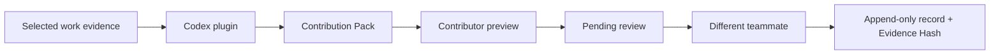

<div align="center">
  

  # Ledger

  Evidence-bound contribution records for human-agent teams.

  [Install the plugin](#install-the-codex-plugin) · [Try it](#try-it) · [Run the app](#run-the-web-app) · [Judge testing](plugins/ledger-contribution/JUDGE_TESTING.md)
</div>

Teams working with AI agents leave evidence across commits, files, tests, deliverables, and chat summaries. When it is time to discuss who did what, that evidence has usually turned into memory.

Ledger turns a bounded set of work evidence into draft contribution claims. The contributor inspects the draft, another authenticated teammate reviews it, and Postgres locks the reviewed record with a server-side Evidence Hash. The result is a durable input to team discussions, not an automated ownership decision.

## What you get

- An installable Codex plugin that creates a portable Contribution Pack from evidence you select.
- An editable import screen that shows every claim and evidence reference before submission.
- Database-enforced peer confirmation. Contributors and agent owners cannot approve their own work.
- Append-only reviewed records with idempotent imports and server-side evidence hashes.
- Non-binding discussion weights for allocation conversations.

## Install the Codex plugin

Ledger supports the Codex desktop app on macOS and Windows, Codex CLI, and the Codex IDE extension. The plugin does not require an OpenAI API key.

Register the marketplace:

```bash
codex plugin marketplace add https://github.com/alexfanzong/ledger-contribution
```

Open Codex, enter `/plugins`, choose the **Ledger** marketplace, and install **Ledger Contribution**. Start a new task after installation so Codex loads the bundled Skill.

For local plugin development, register the cloned checkout instead:

```bash
codex plugin marketplace add /absolute/path/to/ledger-contribution
```

## Try it

Open Codex in a repository and identify the evidence you want included:

```text
Use the Ledger Contribution plugin to create a draft Contribution Pack from commits f4f17a3 and 8a0328c, plus the related test results. Attribute only work supported by those sources.
```

Codex writes `ledger-contribution-pack.json` unless you choose another path. Validate the file before importing it:

```bash
node plugins/ledger-contribution/skills/ledger-contribution-pack/scripts/validate-pack.mjs ledger-contribution-pack.json
```

The plugin reads only the commits, files, tests, deliverables, summaries, and time range you place in scope. It does not scan Codex account history, environment variables, credentials, unrelated folders, or the rest of your computer.

## How it works



The plugin is a draft producer. It cannot choose a reviewer, set final impact, confirm a claim, or create an Evidence Hash. Ledger validates the pack again at the web and database boundaries.

The import RPC binds a human claim to the authenticated member, or an agent claim to an agent that member owns. A project-level pack identity plus a claim-level identity makes concurrent retries resolve to one contribution.

## Run the web app

Ledger uses Next.js 15, TypeScript, Supabase Auth, and Postgres.

```bash
npm install
cp .env.example .env.local
npm run dev
```

Set these values in `.env.local`:

```text
NEXT_PUBLIC_SUPABASE_URL=https://your-project.supabase.co
NEXT_PUBLIC_SUPABASE_ANON_KEY=your-anon-key
```

Apply the files in `supabase/migrations/` to a test Supabase project in timestamp order. The migrations create the schema, Row Level Security policies, immutable-review triggers, evidence hashing functions, and the Contribution Pack import RPC.

The product flow is:

1. Create a project and invite another member.
2. Add a milestone or register an agent contributor.
3. Import a Contribution Pack or enter a contribution manually.
4. Have a different member confirm, partially confirm, or reject the pending record.
5. Inspect the confirmed record and its Evidence Hash in the ledger.
6. Use the simulation page as a non-binding discussion view.

## Trust model

| Boundary | Enforced behavior |
| --- | --- |
| Codex plugin | Produces draft claims from bounded evidence and writes no data to Ledger. |
| Contributor preview | Lets the authenticated contributor edit or skip every claim. |
| Import RPC | Enforces membership, contributor ownership, pack identity, and retry safety. |
| Peer confirmation | Rejects self-review and review of an agent by that agent's owner. |
| Reviewed record | Prevents edits and deletion; corrections create a new superseding record. |
| Evidence Hash | Computes canonical SHA-256 input inside Postgres after peer review. |

Contribution Packs are untrusted input. Evidence text remains inert even when it contains prompt-like instructions. Wallets, signatures, payments, tokens, and on-chain writes are outside this build.

## OpenAI Build Week

Ledger existed before the submission period as a manual contribution ledger with authentication, project membership, peer review, append-only reviewed rows, and non-binding discussion weights.

The Build Week work added the portable Contribution Pack contract, deterministic parsing and actor checks, idempotent database import, imported-evidence display, Evidence Hash v3 coverage, and the installable Ledger Contribution plugin. The dated boundary is documented in [`docs/build-week-baseline.md`](docs/build-week-baseline.md).

### How we collaborated with Codex

Codex with GPT-5.6 was the main development environment for the Build Week increment. Codex helped inspect the competition rules, challenge an early Responses API plan, define the portable pack contract, write parser and provenance tests before implementation, pressure-test the Postgres trust boundary, package the workflow as a plugin, and run the release checks.

The central product decision stayed human: AI may draft a contribution from evidence, but it cannot confirm its own work or turn discussion weights into legal ownership. The repository keeps the resulting trust boundaries visible through tests, migrations, and commits.

## Test

```bash
npm test
npm run typecheck
npm run build
```

The current suite covers pack parsing, actor validation, provenance projection, claim preparation, scoring, superseding records, and retry conflicts. The plugin also ships valid and invalid fixtures for a deterministic test that does not require rebuilding the web app. See [`JUDGE_TESTING.md`](plugins/ledger-contribution/JUDGE_TESTING.md).

## Repository layout

```text
plugins/ledger-contribution/  Codex plugin, Skill, fixtures, and validator
app/projects/[id]/import/     Contribution Pack preview and import flow
lib/imports/                  Dependency-free parsing and validation
supabase/migrations/          RLS, review, immutability, hashing, and import RPCs
docs/                         Build Week boundary and public test instructions
```

## Legal scope

Ledger records contributions and produces non-binding discussion weights. It does not create, transfer, or determine equity, compensation, tokens, or other legal rights. Teams need separate legal documents and professional advice for any binding allocation.

## License

[MIT](LICENSE)
